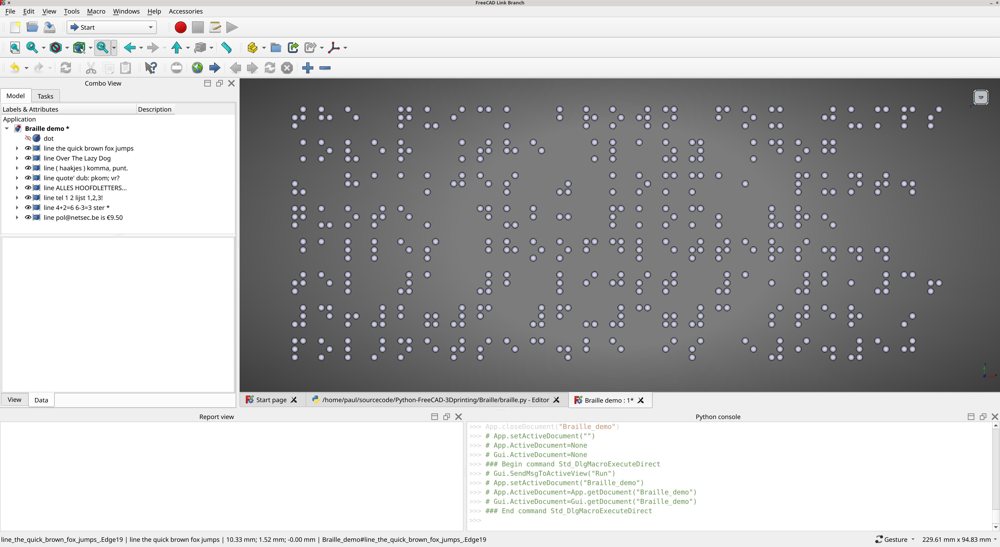
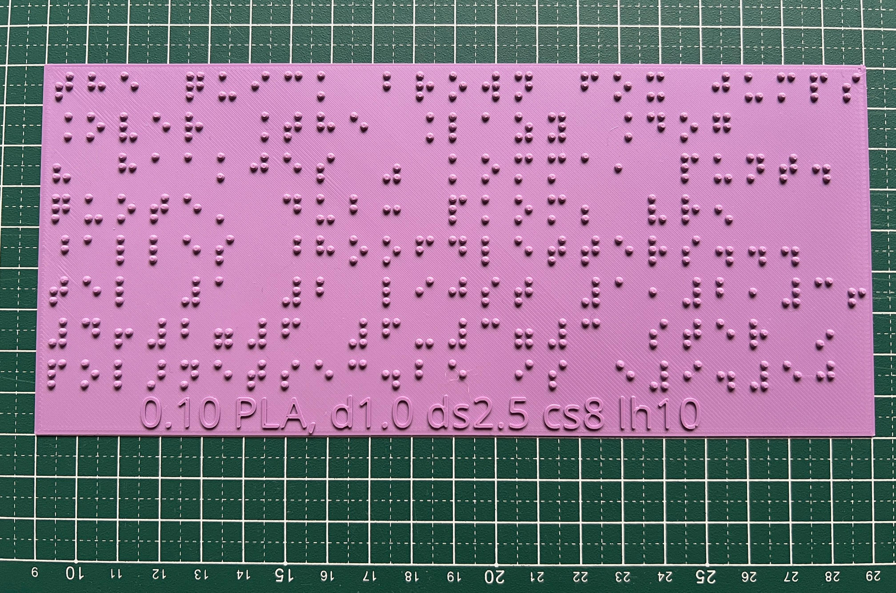
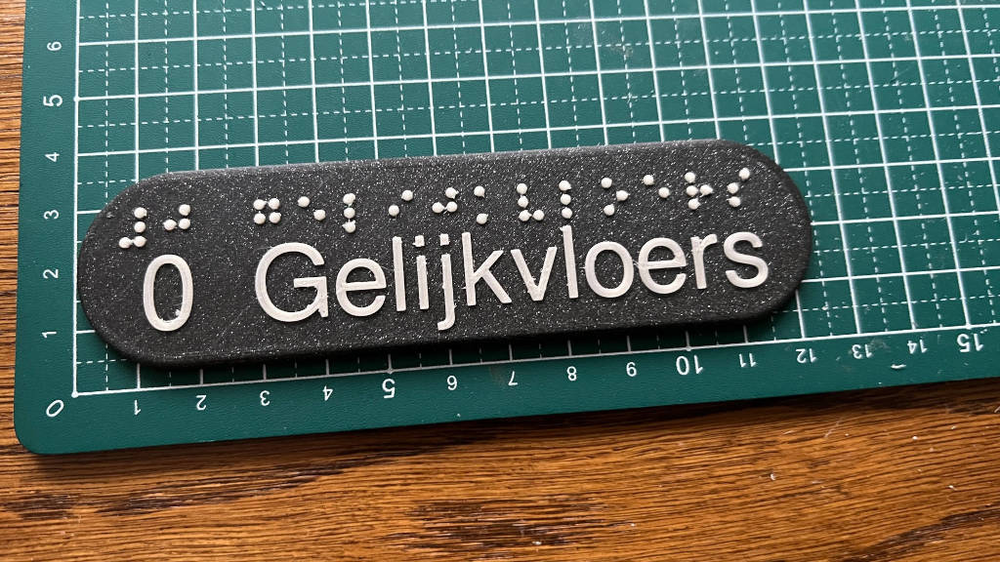

# Python-FreeCAD-3Dprinting

## Generate Braille in FreeCAD

This script generates Braille dots using FreeCAD and Python.
It works by typing a line as a string.
Each Braille line will be named properly and can be copied to your project.

## Careful

3D-Printed braille dots can be sharp. Make sure to soften them!

## FreeCAD

Screenshot of FreeCAD after running the script.

## Note

I work with blind people in Antwerp, so this is the Flemish 'dialect' of Braille.

## Example pictures

The dots from the default script, with a 0.5 thick layer underneath, printed in PLA.

A plaque that is used in an elevator.

## printables.com link

https://www.printables.com/model/1124407-braille-in-freecad
